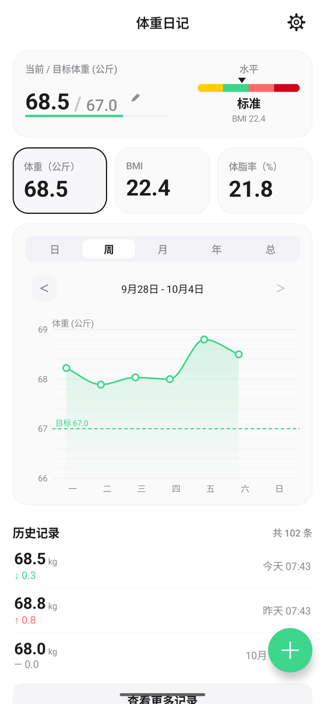
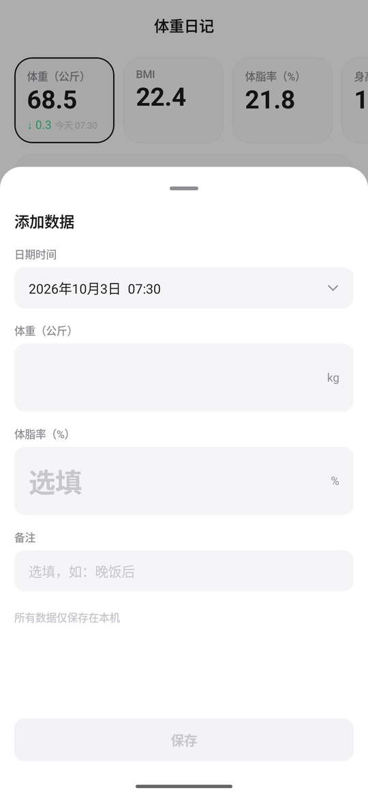
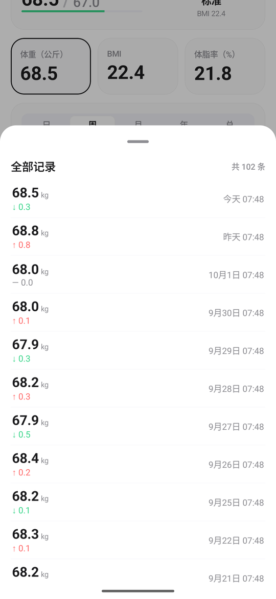
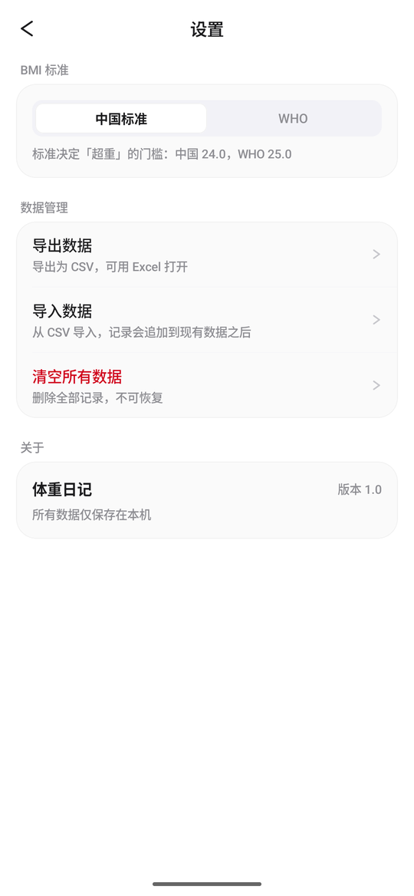

# 体重日记 (WeightDiary)

纯本地的体重 / 体脂趋势记录 App。**没有账号、不联网、没有广告** —— 所有数据只存在你自己的设备上。

<p align="center">
  
  
  
  
</p>

## 功能

- **概览** —— 三张指标卡片（体重 / BMI / 体脂率）＋ 一张「当前 / 目标体重 + BMI 水平」卡片
- **折线图** —— 自绘 Canvas，无第三方图表库。日 / 周 / 月 / 年 / 总五种区间，整数刻度、等宽数字、monotone cubic 平滑
- **记录管理** —— 首页历史区、全部记录、点击编辑、左滑露出删除按钮（左滑本身不删除，必须再点一下）
- **BMI 标准** —— 中国 / WHO 两套阈值可切换
- **数据自主** —— CSV 导出与导入、一键清空；全程不联网
- **轻** —— release 包 **1.55 MB**

## 技术栈

| | |
|---|---|
| 语言 / UI | Kotlin 2.3.20 · Jetpack Compose · Material 3 |
| 存储 | Room（记录）· DataStore（档案） |
| 架构 | 单向数据流（ViewModel + StateFlow）· 手写依赖容器 |
| 图表 | 自绘 Canvas |
| 版本 | minSdk 26（Android 8.0）· targetSdk 36 |

## 快速开始

```bash
./gradlew assembleDebug        # 构建
./gradlew testDebugUnitTest    # 单测（123 个）
./gradlew distRelease          # 出正式签名包 → dist/WeightDiary-<版本>.apk
```

需要 **JDK 17+** 与 **Android SDK（compileSdk 36）**。`local.properties` 里的 `sdk.dir` 指向你的
SDK 位置，该文件不在版本库里，各人自己配。

## 文档

| 文档 | 内容 |
|---|---|
| [开发手册](docs/开发手册.md) | 项目结构、里程碑、关键约定、出包流程 —— **想动手改代码先看这份** |
| [01 需求文档](docs/01-需求文档.md) | 产品定位、功能清单、非目标、验收标准 |
| [02 设计规范](docs/02-设计规范.md) | 设计 token、逐区块界面规格、状态、动效 |
| [03 技术设计](docs/03-技术设计.md) | 架构分层、数据模型、核心算法、风险清单 |
| [04 决策记录](docs/04-决策记录.md) | 全部决策与**被否原因** —— 想改设定之前先翻这里 |
| [05 交付计划](docs/05-交付计划.md) | 里程碑划分与出口标准 |

设计稿是**脚本渲染**的高保真图，不是手绘：改完设计 token 重跑 `docs/assets/render/` 下的脚本即可同步，
设计稿不会与文档脱节。

## License

尚未添加。在补上之前，默认保留所有权利。
