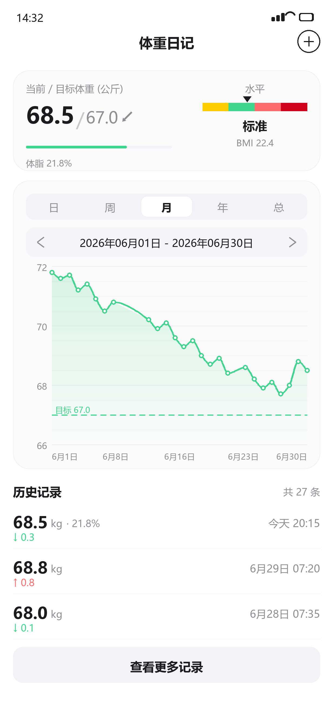
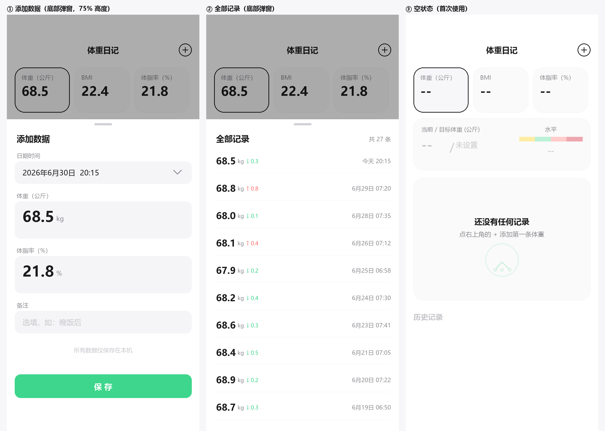

# 02 · 设计规范

> 项目：体重日记（`com.weightdiary.app`）
> 状态：**已定稿并实现**（当前 1.1）
> 相关：[需求文档](01-需求文档.md) · [技术设计](03-技术设计.md) · [决策记录](04-决策记录.md)

**目录**：1 设计稿 · 2 设计 Token · 3 布局总览 · 4 逐区块规格 · 5 底部弹窗 · 6 状态设计 · 7 交互与动效 · 8 无障碍 · 9 设置 · 10 App 图标 · 附录 A 与原始简报的差异

---

## 1. 设计稿

首页 

弹窗与空状态 

> 这些图是**脚本渲染**出来的（`assets/render/ui_mock.py`、`ui_sheets.py`），不是手绘。改完 token 重跑即可同步，设计稿不会与文档脱节。

---

## 2. 设计 Token

### 2.1 颜色

```
背景              #FFFFFF
卡片填充          #FAFAFA      ← 不是纯白，见下方说明
卡片描边          #F0F0F0      0.5dp
主强调（薄荷绿）   #3DD68C
强调悬浮层        #3DD68C @ 12%
主文字            #1C1C1E
次文字            #8E8E93
禁用文字          #C7C7CC
分隔线            #F2F2F7
输入框 / 灰底     #F5F5F7
选中卡片填充      #F7F7F9
图表主刻度线      #F0F0F0
图表次刻度线      #F2F2F2
```

**BMI 四色**

```
黄（较轻）  #FFCC00
绿（标准）  #3DD68C
浅红（超重）#FF6B6B
深红（肥胖）#D0021B
```

> **为什么卡片填充不是纯白**：`#FFFFFF` 卡片放在 `#FFFFFF` 背景上，`elevation` 阴影是看不见的，卡片层次做不出来。用 `#FAFAFA` 填充 + `#F0F0F0` 发丝描边替代阴影。
>
> **次刻度线为什么是 `#F2F2F2` 而不是更浅的 `#F7F7F7`**：首版用 `#F7F7F7` 渲染后确认**在白底上几乎不可见**，刻度加密等于白做。详见 [`assets/chart-ticks.png`](assets/chart-ticks.png)。

### 2.2 圆角

| 元素 | 圆角 |
|---|---|
| 卡片 | 20dp |
| 按钮 / 输入框 | 12dp |
| Tab 容器 | 10dp |
| 日期范围选择器 | 10dp |
| 底部弹窗顶部 | 24dp |

### 2.3 间距（8dp 栅格）

```
页面左右      16dp
卡片之间      12dp
卡片内边距    16dp
区块之间      20dp
```

### 2.4 字体（无衬线，系统默认）

| 用途 | 字号 / 字重 / 颜色 |
|---|---|
| 页面标题 | 17sp / SemiBold / `#1C1C1E` |
| 卡片标签 | 12sp / Medium / `#8E8E93` |
| 主数值 | 28sp / Bold / `#1C1C1E` |
| 次级数值 | 20sp / Medium / `#8E8E93` |
| 正文 | 15sp / Regular |
| 辅助文字 | 13sp / Regular / `#8E8E93` |
| Tab | 13sp / Medium |
| 图表轴文字 | 11sp / Regular / `#8E8E93` |
| 图表目标线标签 | 10sp / Regular / `#3DD68C` |

> **数字必须用等宽字形**（`FontFeatureSetting("tnum")`）。大号体重数字做动画变化时，非等宽数字会导致宽度抖动。

---

## 3. 布局总览

首页自上而下是一条纵向滚动的列（实现是 `Column` + `fitVerticalScroll`，不用 `LazyColumn` —— 历史区固定只展示最近几条，数据量恒定）：

```
状态栏                        系统决定（实测 1080×2400 上 63px ≈ 23dp）   ← 不是固定值
顶部导航栏                    56dp
  ├ 标题「体重日记」居中 17sp SemiBold
  └ 只有居中的标题（右侧原先的 + 按钮已移到右下角的悬浮按钮）
间距 8dp
目标与水平卡片               min 110dp（填过体脂则增高）
  ├ 左栏：当前 / 目标体重 + 进度条
  └ 左栏底部：最近一次体脂（没填过则整行不出现）
间距 12dp
图表卡片                     356dp
  ├ Tab 栏                    32dp
  ├ 日期范围选择器            36dp
  └ 折线图                   220dp（绘图区）
间距 20dp
历史记录                     标题 22dp + 每项 56dp
间距 12dp
「查看更多记录」按钮         44dp
底部留白                     24dp
```

总内容高度约 **886dp**（比早先少了「概览卡片行」的 84dp + 12dp 间距），在 852dp 高的屏幕上仍需滚动。

> **装不下才滚，装得下就不让滚**：一屏放得下时页面不响应纵向滑动。否则那一下回弹会让人
> 以为下面还有内容，界面也显得松垮。判定与理由见 [`04` §7.11](04-决策记录.md)。

> **实现注记（M1 落地时发现）**
>
> 1. 状态栏高度**不是设计能定的**，由系统决定。设计稿里写的 44dp 只是估值，实现必须用
>    `WindowInsets.statusBars` 动态避让，不能写死。
> 2. targetSdk 35+ 在 Android 15 上**强制边到边**。不调 `enableEdgeToEdge()` 的话，窗口虽然铺满全屏，
>    但系统栏图标会用默认（浅色）绘制 —— 在纯白背景上等于不可见，现象就是**「状态栏消失了」**，
>    同时内容会顶到屏幕最上沿和标题重叠。
> 3. 按决策 C9，背景仍延伸到状态栏之下，只把**内容**做 insets 避让（`windowInsetsPadding`），
>    底部再避让一次手势条。

> **卡片宽度（历史记录）为什么是 112dp 而不是 120dp**：393dp 宽的屏幕上，16 + 120×3 + 10×2 = 396 > 393，第 3 张卡会被裁掉半张。112dp 时前三张完整可见、第 4 张（身高）露出一条边作为滑动暗示。

---

## 4. 逐区块规格

### 4.1 顶部导航栏（56dp）

- 标题居中，17sp SemiBold
- 居中标题
- 右上角：**设置按钮**（齿轮，22dp，触摸区 48dp）。功能待定 —— 目前点击只弹一条
  「设置功能即将推出」，不做成一个点了没反应的死按钮

### 4.1a 设置入口

顶栏右上角一个**六角螺母**图标（正六边形外框 + 中心圆，20dp，描边 1.6dp，触摸区 48dp）。
图标前后试过四版：八齿齿轮（细节太多，22dp 下糊）、三条滑块（小尺寸下偏吵）、
细线六齿齿轮（远看像靶心）、最后定为六角螺母 —— 它是唯一在小尺寸下依然结实、
且与 App 其它圆润描边图标形成清晰对比的方案。

### 4.1b 悬浮的「添加数据」按钮

原先它是顶栏右侧一个描边圆圈，但点下去弹窗从**下方**升起 —— 按钮在上、结果在下，
操作与反馈在空间上不呼应。改成右下角的悬浮按钮后就顺了。

- 位置：右下角，距边缘 16dp
- 尺寸：56dp 圆形，主色 `#3DD68C` 填充，白色 "+"（20dp，2dp 圆角线帽）
- **全 App 只有它用阴影**（6dp）—— 卡片一律描边不用 elevation，但悬浮按钮不加阴影
  就只是「贴在角落的一个圆」，读不出「浮」的意思
- 首页内容底部预留 88dp 净空，免得它把最后一块内容永久盖住
- 与 Snackbar 的关系交给 `Scaffold` 处理：Snackbar 出现时按钮自动上移，两者不会叠在一起
- 无左侧返回（首页）

### 4.2 概览卡片行 —— **已移除**

原先这里是三张卡（体重 / BMI / 体脂率），点哪张就把图表纵轴切成哪个指标。

**2026-10 删除**，理由见 [决策记录 · D1](04-决策记录.md)：

- BMI 预警改成直接叠加在体重图上的**阈值线**，不再需要切到 BMI 图去看
- BMI 的数值本来就在目标卡里显示（`BMI 22.4`），卡片是重复的
- 图表现在**只画体重**，那三张卡的主要作用（切指标）随之消失

体脂率改在目标卡与历史记录行里显示（见 §4.3、§4.6）。

### 4.3 目标与水平卡片（min 110dp）

```
┌──────────────────────────────────────────────────────┐
│  当前 / 目标体重 (公斤)        │        水平          │
│                                │      ▼               │
│  68.5  /  67.0  ✎             │  ▮▮▮▮▮▮▮▮▮▮▮▮        │
│  ▁▁▁▁▁▁▁▁▁▁▁▁▁▁▁▁▁▁▁          │      标准            │
│                                │     BMI 22.4         │
└──────────────────────────────────────────────────────┘
```

**左栏（flex 1）**

- 标签「当前 / 目标体重 (公斤)」12sp 灰
- 数值行：当前体重 28sp Bold · 斜杠 24sp `#C7C7CC` · 目标 20sp Medium `#8E8E93` · 编辑铅笔图标 16dp
- 编辑图标打开 **「编辑个人资料」弹窗**，内含**身高**与**目标体重**两个字段 —— 这是全 App **唯一的身高修改入口**
- 底部目标进度条：3dp 高，圆角；底槽 `#F2F2F7`，完成部分 `#3DD68C`
  - 起点 = **设置目标时的体重**，终点 = 目标体重
  - 未设目标时整条不显示
- 未设目标时，数值行显示 `-- / 未设置`

**右栏（固定约 129dp）**

- 「水平」12sp 灰居中
- 四色条：高 10dp，圆角 5dp，**四段等宽（各 25%）**，分界 BMI 18.5 / 24.0 / 28.0
- 三角滑块：宽 10dp，位于色条**上方**，尖端朝下指向色条
- 等级文字：15sp Bold `#1C1C1E`（较轻 / 标准 / 超重 / 肥胖）
- 下方补一行 `BMI 22.4`（11sp 灰），让用户知道滑块的依据
- 达成目标时整个卡片填充 `#3DD68C` @ 12% + 一次性微动效

### 4.4 图表卡片（356dp）

**Tab 栏（32dp）**

- 容器 `#F2F2F7`，圆角 10dp，内 padding 3dp
- 5 项等分：日 / 周 / 月 / 年 / 总
- 选中项：白底，圆角 8dp，`#F0F0F0` 描边，文字 13sp Medium `#1C1C1E`
- 未选中：透明底，文字 13sp `#8E8E93`

**日期范围选择器（36dp）**

- 灰底 `#F5F5F7`，圆角 10dp
- 左右各一个箭头（16dp，`#8E8E93`），中间文字 13sp，如 `2026年06月01日 - 2026年06月30日`
- **点中间文字弹出日期选择器**，可直接跳转
- 右箭头在「已到最新」时置灰禁用

**折线图（绘图区 220dp）**

- **Y 轴**
  - 标题「体重 (公斤)」11sp 灰，左对齐（切指标时文案随之变化）
  - 主刻度 4 条（带数字）：横贯绘图区，1dp `#F0F0F0`，数字 11sp `#8E8E93` 右对齐在轴线左侧
  - 次刻度 9 条（不带数字）：横贯绘图区，1dp `#F2F2F2`
  - 共 **13 条水平刻度线**
- **X 轴**
  - **只画文字，不画任何刻度线**。标签**按视图分类**，不是统一的「5 个等分」：
    | 视图 | 标签 | 例 |
    |---|---|---|
    | 日 | 0 / 6 / 12 / 18 / 24 时 | `00:00` `06:00` `12:00` `18:00` `24:00` |
    | 周 | 周一至周日，7 个 | `一` `二` `三` `四` `五` `六` `日` |
    | 月 | 1 / 10 / 20 / 月末 | `1` `10` `20` `31` |
    | 年 | 1 至 12 月，12 个 | `1` `2` … `12` |
    | 总 | 区间长度不固定，只能 5 个等分 | `6/15` `7/12` `8/9` `9/6` `10/3` |
  - 日期一律用 `M/d` 而不是 `M月d日` —— 后者在「总」视图那种要放 5 个标签的场合太占地方
  - 字体放大导致放不下时按需要抽稀（隔一个、隔两个…），但年视图的裸数字 12 个能放下
  - **不画垂直网格线**
- **折线**：`#3DD68C`，2dp，monotone cubic 平滑；整条序列连续平滑，**跨越未记录日期时同样是实线**
- **数据点**：空心圆，半径 4dp，描边 2dp 绿，填充白 —— **这是唯一的「真实测量」标记**
- **渐变填充**：折线下方到底边，`#3DD68C` 从 20% 透明度渐变到 0%
- **水平参照线**：目标线与 BMI 阈值线**同一种画法** —— 水平虚线（`PathEffect.dashPathEffect`），
  1.5dp，左侧标签 10sp。颜色区分来源：

  | 线 | 颜色 | 标签例 |
  |---|---|---|
  | 目标线 | 主色 `#3DD68C` | `目标 67.0` |
  | BMI 阈值线 | 对应等级的色 token（`bmiNormal` / `bmiOverweight` / `bmiObese`） | `超重 73.5` |

  - **层级**：次刻度之上、折线之下 —— 虚线压在数据上会抢注意力
  - 标签按 y 排序后依次下压，**保证两个标签不重叠**（目标可能刚好落在某个临界值上）

- **BMI 阈值线**：`阈值体重 = BMI 阈值 × 身高²`，用设置里的中国 / WHO 标准
  - **只画落进当前 Y 轴窗口的那些**，视野外一律不画，**绝不为了画它去撑大坐标轴**
  - 效果：体重贴近某个临界值时那条线自然出现，离得远就不出现
  - 没设身高时一条都不画（宁可功能不出现，也不能画错位置）

- **目标线的纳入判据**（2026-10 改）：

  ```
  步长(只用数据) == 步长(数据 + 目标)  →  目标线纳入坐标轴，画在轴内
  否则                                →  轴按数据走，目标改用绘图区内的角标
  ```

  窗口宽度永远是 `3 × 主步长`。目标离得远时纳入它会让步长从 1 跳到 3，窗口从 3 个单位
  涨到 9 个，折线振幅从 47% 掉到 16%。判据精确对应「纳入它要不要付代价」。
  **产品要求「目标线必须常驻」依然满足** —— 换成角标后信息反而更全（直接写出还差多少 kg）。

- **目标角标**：`目标 60.0 ▼ 还差 8.5 kg`，圆角 6dp，底色主色 12% 透明
  - **画在绘图区内部** —— 贴在外面会压住 X 轴刻度（实测过，把「六」挡住了）
  - 贴下沿还是上沿由目标的方向决定；那一侧被数据占满时自动翻到另一侧

### 4.5 历史记录列表

- 区块标题「历史记录」15sp Bold + 右侧「共 27 条」12sp 灰
- 每项高 56dp：
  - 左：体重 20sp Bold + `kg` 小字 + 变化量 12sp（绿↓ / 红↑）
  - 右：日期时间 13sp 灰，如 `今天 20:15` / `6月29日 07:20`
  - 分隔线 0.5dp `#F2F2F7`
- 默认展示最近 2–3 条
- 「查看更多记录」按钮：全宽，高 44dp，`#F2F2F7` 圆角 12dp，文字 15sp Bold 居中

---

## 5. 底部弹窗

两个弹窗共用同一模式：`ModalBottomSheet`，高度 **75%**（约 3/4 屏），顶部圆角 24dp，顶部居中拖拽把手（36×4dp，`#D1D1D6`）。背景遮罩 `#000000` @ 32%。

### 5.1 添加数据

```
拖拽把手
添加数据                                    17sp Bold
日期时间    2026年6月30日  20:15      ▾      灰底圆角 12dp，高 46dp
体重（公斤）[ 68.5 kg ]                      灰底，高 76dp，数字 30sp Bold
体脂率（%）[ 21.8 % ]                        同上
备注        [ 选填，如：晚饭后 ]             灰底，高 46dp，占位文字 #C7C7CC
              所有数据仅保存在本机            12sp 居中 #C7C7CC
[              保 存              ]          全宽 48dp，主色填充，白字
```

- 大号数字字段用数字键盘
- 保存按钮在必填项无效时禁用（体脂率与备注可留空）
- 日期时间默认当前时刻，点击弹出**日期选择器**（最大值 = 今天）
- **刻意不做时间选择器**（2026-10 修订）：用户只需要说清「哪一天」，几点几分对他没有参考意义，
  多一级选择就多一步操作。记录里存的时分是「保存那一刻」，它只用于同日排序，**不是用户输入**。
  改动原因见 [`04-决策记录` §7.1 HC12](04-决策记录.md)

### 5.2 全部记录

- 标题「全部记录」17sp Bold + 右侧「共 27 条」12sp 灰
- `LazyColumn` 全量列表，每项 56dp，行内容与首页历史列表一致
- 点击某项 → 进入编辑。**弹窗不关闭，只把内容换成编辑表单**，
  表单顶部有「‹ 全部记录」可退回。关掉再弹一个新弹窗会让用户看到
  「收回 → 弹出 → 收回 → 弹出」，很乱
- **左滑 → 行滑到三分之一处停住，露出右侧红色「删除」按钮 → 点该按钮才真的删除**
  - **仅限「全部记录」弹窗**。首页历史区是高频浏览区，不做左滑，避免误触`n  - **同一时刻只能划开一行**：划开第二行时第一行自动弹回
  - 滑动本身**不删除**，只是露出按钮；再点一次才算确认`n  - 已取消长按入口：它没有任何视觉提示，与左滑重叠，且取消撤销后误触不可恢复`n  - 因为是二次确认，**不再有「已删除」的撤销 Snackbar**

### 5.3 编辑个人资料

- 两个字段：身高（cm）、目标体重（kg）
- 这是身高的唯一修改入口
- 保存后历史 BMI 全部重算

---

## 6. 状态设计

> 原始简报**完全没有定义状态**，但空状态正是用户看到的第一屏。

| 状态 | 表现 |
|---|---|
| **首次使用，无任何数据** | 目标卡片 `-- / 未设置`，体脂行不出现；水平条四色**降透明度至 35%** 且无滑块，等级位显示 `--`；图表区域显示空状态：`还没有任何记录` + `点右下角的 + 添加第一条体重` + 淡色插画；历史记录标题灰显，不显示列表项 |
| **有体重，无身高** | 目标卡片的 BMI 显示 `--`；水平条同上灰显；**图表一条 BMI 阈值线都不画**（算不出来）。身高仍可从目标卡的铅笔入口补填 |
| **有体重，无目标体重** | 目标卡片 `-- / 未设置`；进度条不显示；图表不画目标虚线，也不出现目标角标 |
| **只有 1 条记录** | 折线退化为**单个空心点**（不能空白，也不能画线） |
| **有记录但都没填体脂** | 目标卡片不显示体脂行；历史记录行只显示体重（行高与有体脂的行一致） |
| **所有记录数值相同** | Y 轴上下各扩 1kg，折线为水平线 |
| **加载中** | 骨架屏（`#F2F2F7` 圆角块），**不用转圈** |

---

## 7. 交互与动效

| 场景 | 动效 |
|---|---|
| 数值变化 | `animateFloatAsState`，300ms，配等宽数字防抖动 |
| 切换 Tab / 日期范围 | 折线淡出 → 重算 → 淡入，200ms |
| 新增数据点 | 从下方弹入 + 缩放 |
| 达到目标体重 | 目标卡片变绿 + 一次性脉冲，**不弹窗** |
| 保存成功 | Snackbar「已记录 68.5 kg」，带「撤销」 |
| 左滑记录 | 行跟手左移，松手吸附到三分之一处（露出删除按钮）或弹回原位，180ms |

**手势职责划分**（必须严格区分，否则会打架）：

| 手势 | 作用范围 | 职责 |
|---|---|---|
| 左右箭头点击 | 日期范围选择器 | **切换日期范围**（唯一入口） |
| ~~图表内左右滑动~~ | 图表 | **已取消** —— 五个视图都一次画完整段范围，图表区不响应横向手势 |
| 上下滑动 | 全页 | 页面纵向滚动 |

图表区已不消费任何横向手势；首页内容一屏放不下时只做纵向滚动，**装得下时连纵向也不滚**（`fitVerticalScroll`）。**页面纵向滚动仍是唯一的手势**。

---

## 8. 无障碍

- 所有图标按钮必须有 `contentDescription`：「添加数据」「编辑个人资料」「上一天」「下一天」
- 触摸目标 ≥ 48×48dp（视觉可以更小）
- **颜色不是唯一信息载体**：BMI 等级必须同时有文字（已满足：较轻 / 标准 / 超重 / 肥胖）
- 支持系统字体放大：区块高度用 `wrapContentHeight` + `minHeight`，不要写死高度导致裁切
- 图表提供 `semantics` 描述，如「最近 7 天体重从 69.2 公斤下降到 68.5 公斤」
- 变化量箭头 `↓↑` 需同时提供文字语义（「下降 0.3 公斤」），不能只靠符号和颜色

---

## 附录 A. 与原始简报的差异

以下是有意偏离简报的地方，每条都记录原因，改动前请先读 [决策记录](04-决策记录.md)。

| 项 | 简报 | 最终 | 原因 |
|---|---|---|---|
| 主色 | `#34C759` | `#3DD68C` | 前者实为 iOS 系统绿，偏黄偏亮，不算薄荷绿 |
| 四色条比例 | 未指定 | **四段等宽各 25%** | 视觉整齐；代价是滑块改为段索引映射 |
| X 轴刻度线 | 「刻度显示日期」 | **完全不画刻度线** | 30 条日历刻度让图面很碎 |
| 折线跨空缺 | 未指定 | **连续平滑实线**（曾短暂用虚线） | 虚线破坏曲线整体观感，改由空心点区分实测 |
| 身高修改入口 | 未给 | **合并进编辑个人资料弹窗** | 原设计里身高卡片不可点，形成功能黑洞 |
| 概览卡片行 | 三张卡切换图表指标 | **整组删除** | BMI 预警已进图表，见 [决策记录 · D1](04-决策记录.md) |
| 概览卡片宽 | 隐含 120dp | **112dp** | 120dp 时第 3 张卡会被屏幕裁掉 |
| 卡片填充色 | 纯白 + 阴影 | **`#FAFAFA` + 发丝描边** | 纯白卡片上的阴影不可见 |
| 变化量 | 未提 | **列表与卡片都显示** | 体重 App 的高频期待 |
| 卡片时间标注 | 未提 | **体重卡片显示记录时间** | 化解「最新值 vs 当日最低值」的困惑 |

---

## 9. 设置

**整屏页面**，不是底部弹窗 —— 入口按钮在右上角，再用从下往上弹的弹窗就不呼应了
（和「添加数据」改用右下角悬浮按钮是同一个道理）。

**主页只是一张导航表**：四行入口（BMI 标准 / 数据管理 / 实验功能 / 关于），
每行只有标题和一个箭头，点进去才是具体设置。原来四节十来行全铺在一屏里，
越加越像说明书（理由见 [`04` §7.10](04-决策记录.md)）。

- 顶栏与首页同高（56dp）：左侧返回箭头（20dp，触摸区 48dp），标题居中 ——
  主页是「设置」，子页是那一节的名称，进对不对一眼能确认
- 进入 / 退出左右滑动，方向按**层级**定：往里走从右滑入，往回退从左滑入
- 系统返回键**逐级回退**：子页 → 设置主页 → 首页（规则是 `backTarget()`，有单测）
- 设置各页都**不显示**首页那个「添加数据」悬浮按钮
- 主页**没有搜索**：一共四行，搜索框本身比它要找的东西还占地方
- 主页四行**都不带副标题**，右侧只有箭头。代价是看不出「实验功能」开着没有 ——
  要状态就得点进去

四页，标题就是下面各节的名称：

### 9.1 BMI 标准

- 二选一分段控件（样式与图表 Tab 栏一致）：**中国标准** / **WHO**
- 说明文字：标准决定「超重」的门槛：中国 24.0，WHO 25.0
- 默认中国标准。改它之后首页的水平条分段边界与等级文字立即跟着变

### 9.2 数据管理

| 项 | 行为 |
|---|---|
| 导出数据 | 存为 CSV。默认文件名 `WeightDiary-<日期>.csv` —— **英文名**（红线 #2：中文文件名在 Windows / adb / 手机之间转手会乱码），用户自己选位置 |
| 导入数据 | 从 CSV 导入，**追加**到现有数据之后 |
| 清空所有数据 | 红色。二次确认后删除全部记录，**身高与目标设置不受影响** |

- 导入导出都走 SAF（系统文件选择器），**不需要存储权限**，也不会有「App 偷偷写了什么」的疑虑
- CSV 带 BOM（否则 Excel 打开中文备注是乱码），时间为秒级精度带时区偏移
- 导入**尽量多救回几行**：单行格式不对只跳过那一行并计数，不整份失败

### 9.3 实验功能

目前只有「体脂秤同步」一项。**它单独成一页、而不是并进「数据管理」，是刻意的**（见 [`04` §7.6](04-决策记录.md)）；
**整页还压在一个默认关闭的总开关下**（见 [`04` §7.7](04-决策记录.md)）。

| 项 | 行为 |
|---|---|
| 启用实验功能 | 总开关，**默认关闭**。**API < 28 时主页那一行也不出现**（进不去的页没必要留入口） |
| 体脂秤同步 | 总开关打开后才出现。通过系统「健康数据共享」读取体重与体脂率 |
| 手动同步 | 默认关闭。打开后首页顶栏在设置齿轮左边多一个同步按钮，**点一下才同步**；同步期间按钮**转成强调色并旋转**，且**最少转满一圈**（一圈 450ms，收尾正好回到原位） |
| 自动同步 | 默认关闭。打开后**每次冷启动（进程创建）自动同步一次** |

- 两个同步开关**互不影响，可以同时打开**（手动点得到、启动也会自动拉一次）
- 总开关关着时，「体脂秤同步」那行**仍可点，但只用于授权与看状态，不发起同步**
- 总开关关掉时：已同步的记录**保留**、两个开关的值**保留**、首页按钮与下面三行**隐藏**；「清空所有数据」只删同步水位线，**不动开关**（清数据不是恢复出厂）
- 「体脂秤同步」那行**只在有动作可做**时（建锚点 / 授权 / 未安装 / 需更新）可点并显示箭头；完全配好后退化成纯信息 —— **不可点、不画箭头**。挂着一个箭头却点不动，比不能点更糟
- 自动同步是**静默**的：没授权、或库里还没有手动记录（没有锚点）时直接跳过，不弹窗不打断启动
- 行下常驻一句说明（`settings_hc_experiment_hint`）：此功能为实验性质：通过「健康数据共享」读取数据，需要体脂秤应用能够将称重数据写入。部分品牌的应用未提供该能力
- **为什么强调这句**：能不能用取决于**第三方 App 愿不愿意往 HC 写**，不是本 App 能控制的事（小米官方 App 就不写）。不写清楚的话，用户用不了时只会觉得是坏的
- 分节标题、行内说明、节下提示三层都用既有 token，视觉上与「数据管理」一致；开关的**未选中态必须显式配色**（轨道与卡片同色时看起来像坏的）
- 同步按钮转圈是 §7「加载中不用转圈」的**例外**：那条针对**页面加载**（用骨架屏），这里反馈的是**刚被点的那枚按钮**在做用户主动触发的动作，反馈必须落在那枚按钮上。**最少转满一圈**（450ms）有两个理由：实测同步常在几十毫秒内结束，不补时长就根本看不见；而补的时长必须凑成**整数圈**，否则图标会在转到一半时被拽回原位（见 [`04` §7.8](04-决策记录.md)、[`09` §6.20](09-真机实测记录.md) 与 [`09` §6.21](09-真机实测记录.md)）

### 9.4 关于

- App 名 + 版本号
- 「数据仅在本机处理。若系统已开启备份，备份内容可能包含本应用数据」—— 如实表述，理由见 [`04` §9.1](04-决策记录.md)
- **「查看新版本」**：点一下由**浏览器**打开 GitHub 发布页（`.../releases/latest`，会自动跳到最新正式版）。联网的是浏览器，App 自己只发一个 `ACTION_VIEW`，因此**不必声明 `INTERNET`**，「零网络权限」这条定位不变。措辞刻意是**查看**而不是**检测** —— 这一档做不到替用户查有没有新版（见 [`04` §7.9](04-决策记录.md)）

---

## 10. App 图标

自适应图标：薄荷竖向渐变背景层 + 白色横向圆角卡片前景层，卡片上一条薄荷折线。

### 10.1 安全区是硬约束

Android 的圆形蒙版**内切于中央 72×72**，即以画布中心为心、半径 36 的圆。
前景的任何一个角超出这个圆就会被削掉。

卡片几何与验算：

| 项 | 值 |
|---|---|
| 卡片 | x 26..82（宽 56），y 33..75（高 42），圆角 13 |
| 圆角弧心距中心 | √(15² + 8²) = 17.0 |
| 最远点 | 17.0 + 13 = **30.0** |
| 安全半径 | 36 |

30.0 < 36，四角与四边都在安全区内。

> **踩过的坑**：初版卡片是 62×58，四角距中心 **42.4**，远超 36，真机上四角被削。
> 更糟的是做对照图时把蒙版半径按整个 108 画布算（54），恰好把裁剪问题掩盖了 ——
> **对照图的蒙版画错，比不画对照图更危险**，因为它会给出虚假的安心感。